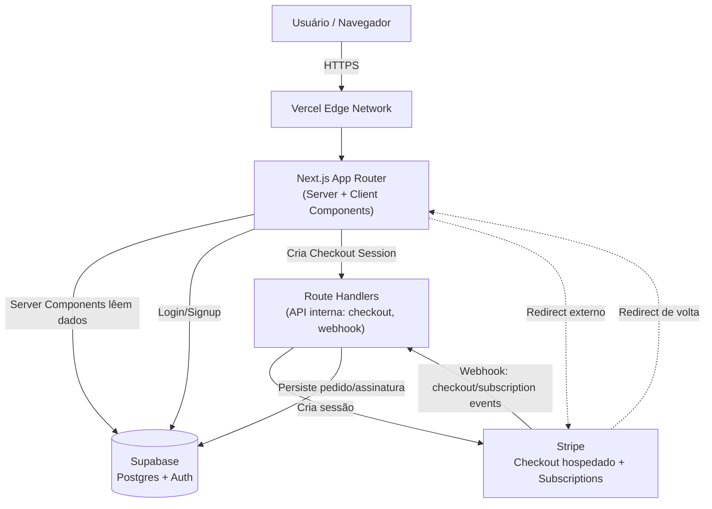
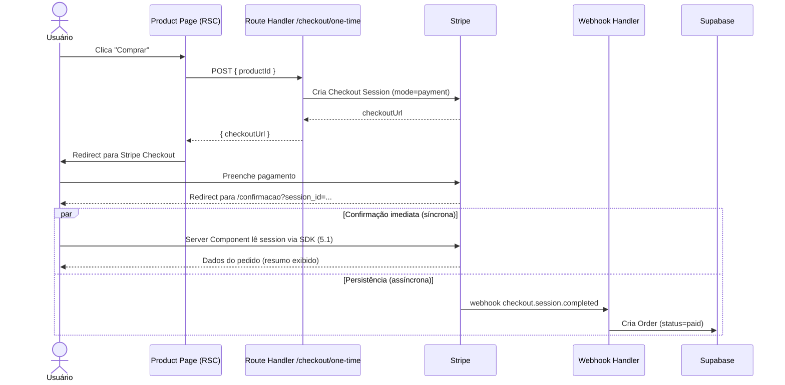
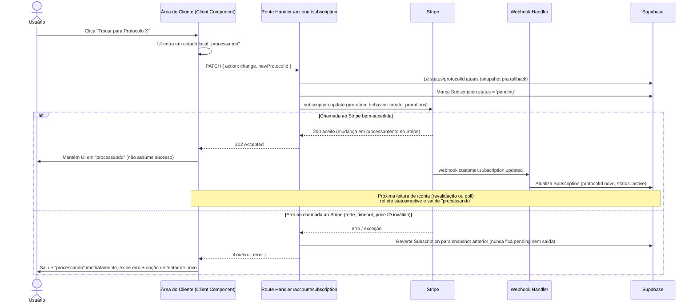
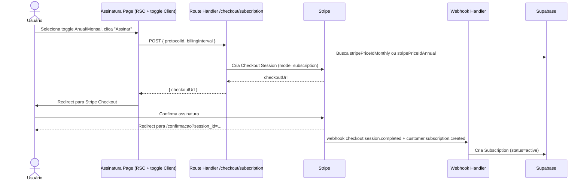

# TRIA Fullstack Architecture Document

## 1. Introduction

Este documento descreve a arquitetura fullstack completa do TRIA, cobrindo backend, frontend e sua integração. Serve como fonte única de verdade para o desenvolvimento orientado por agentes de IA, garantindo consistência em toda a stack.

Essa abordagem unificada combina o que tradicionalmente seriam documentos separados de arquitetura backend e frontend, já que no TRIA (Next.js App Router monolítico) essas camadas estão intrinsecamente entrelaçadas.

### 1.1 Starter Template or Existing Project

N/A - Greenfield project. Não há starter fullstack pronto sendo usado. Scaffold via `create-next-app` (App Router, TypeScript, Tailwind), conforme preset `nextjs-react` do AIOX (`.aiox-core/data/technical-preferences.md`). Nenhuma decisão arquitetural pré-existente a herdar.

**Versão do Next.js:** sempre a versão estável mais recente disponível no momento do scaffold (documentada como 16+ no momento da escrita deste documento — não travar nesse número; confirmar em `npm view next version` no dia do Story 1.1).

### 1.2 Change Log

| Date       | Version | Description                                                    | Author         |
| :--------- | :------ | :--------------------------------------------------------------- | :------------- |
| 2026-07-08 | 0.1     | Documento de arquitetura criado a partir do PRD aprovado pelo @po | Aria (Architect) |

## 2. High Level Architecture

### 2.1 Technical Summary

TRIA é um monolito serverless construído em Next.js (App Router), hospedado na Vercel, combinando frontend (React Server/Client Components) e backend (Route Handlers) numa única aplicação. Persistência via Supabase (Postgres + Auth), pagamentos via Stripe (Checkout hospedado + Subscriptions API com webhooks). A integração frontend-backend acontece via Route Handlers internos (sem API pública separada) e via redirect externo para o Stripe Checkout. Toda infraestrutura é gerenciada (Vercel/Supabase/Stripe) — sem servidores, containers ou IaC customizada. Essa arquitetura atinge os goals do PRD (lançar rápido, validar demanda orgânica, manter escopo enxuto) minimizando superfície operacional: nada para provisionar manualmente, deploy automático a cada push.

### 2.2 Platform and Infrastructure Choice

**Opções consideradas:**

1. **Vercel + Supabase** _(recomendado)_ — deploy Next.js nativo, Postgres+Auth gerenciados, free tier cobre MVP, zero DevOps. Contra: menos controle fino de infra que AWS.
2. **AWS Full Stack** (Amplify/Lambda/RDS/Cognito) — mais controle e escala, mas complexidade de setup e curva de aprendizado incompatíveis com o timeline de validação rápida do projeto.
3. **Railway/Render + Postgres gerenciado** — alternativa viável, mas sem a integração nativa Next.js que a Vercel oferece, e sem Auth pronto (precisaria de Supabase Auth ou Clerk à parte de qualquer forma).

**Recomendação:** Vercel + Supabase — já era a direção do PRD (Seção 4), aqui apenas formalizada como decisão arquitetural. Alinhado ao objetivo de "lançar e validar" com esforço operacional mínimo.

**Platform:** Vercel (frontend + Route Handlers) + Supabase (Postgres + Auth)
**Key Services:** Vercel (hosting, deploy, edge functions), Supabase (Postgres, Auth, Storage para imagens se necessário), Stripe (Checkout, Subscriptions, Webhooks)
**Deployment Host and Regions:** Vercel — região automática mais próxima do público-alvo (Brasil → `gru1`/São Paulo quando disponível, fallback US East); Supabase — projeto na região `sa-east-1` (São Paulo) por proximidade e LGPD.

### 2.3 Repository Structure

**Structure:** Repositório único (não-monorepo no sentido de múltiplos packages) — aplicação Next.js única na raiz do projeto. Não há apps/pacotes separados a coordenar (sem mobile app, sem serviço backend distinto).
**Monorepo Tool:** N/A — não há necessidade de Nx/Turborepo para uma única aplicação Next.js.
**Package Organization:** Estrutura padrão Next.js App Router (`app/`, `components/`, `lib/`, `types/`) — ver Seção 12 (Unified Project Structure) para detalhe completo.

### 2.4 High Level Architecture Diagram



### 2.5 Architectural Patterns

- **Serverless Monolith (Jamstack-adjacent):** Next.js App Router com Route Handlers na Vercel — _Rationale:_ escopo de 5 telas + checkout não justifica microsserviços; zero infra para gerenciar, escala automaticamente.
- **Server Components para leitura de catálogo:** dados de produtos/protocolos buscados no servidor (RSC), sem client-side fetching desnecessário — _Rationale:_ melhor performance percebida e SEO para páginas de vitrine (Home, Produtos, Assinatura).
- **BFF implícito via Route Handlers:** Route Handlers atuam como Backend-for-Frontend, escondendo chaves secretas do Stripe/Supabase do client — _Rationale:_ segurança (chaves nunca expostas ao navegador) sem precisar de um serviço de API separado.
- **Webhook-driven state sync:** estado de pedidos/assinaturas no banco é sempre atualizado via webhook do Stripe, nunca otimisticamente pelo client — _Rationale:_ fonte única de verdade é o Stripe; evita inconsistência entre o que o usuário vê e o que foi realmente cobrado (decisão já validada com @po na Story 2.2).
- **Repository-lite data access:** camada fina de funções de acesso a dados (`lib/data/*`) entre Server Components/Route Handlers e o Supabase client — _Rationale:_ evita chamadas Supabase espalhadas pelo código, facilita eventual troca/mocking em testes.
- **ISR para páginas de catálogo:** Home (`/`), About (`/about`), Produtos (`/produtos`) e Assinatura (`/assinatura`) usam Incremental Static Regeneration (`revalidate: 3600`, 1h) — _Rationale:_ sem painel de admin no escopo, o catálogo só muda via edição manual no Supabase (Story 1.2); consultar o banco a cada visita seria desperdício numa página que quase nunca muda. `/conta` permanece 100% dinâmica (`export const dynamic = 'force-dynamic'`) por depender de sessão e dados do usuário; a página de confirmação de checkout (Story 2.5) também é dinâmica pelo mesmo motivo.

> **📌 Item rastreado (levantado pelo @po/@architect review):** como o webhook-driven state sync não é otimista, a UI da Área do Cliente (Story 3.4 — trocar/pausar/cancelar protocolo) precisa de um estado intermediário "processando" entre o clique e a confirmação via webhook. Resolvido explicitamente em: Seção 6 (Core Workflows — sequence diagram) e Seção 8.2 (State Management — campo `status: pending|active|past_due|canceled`).

## 3. Tech Stack

> Esta é a seleção DEFINITIVA de tecnologia para o projeto inteiro — todo desenvolvimento deve usar exatamente estas escolhas.

| Category | Technology | Version | Purpose | Rationale |
|---|---|---|---|---|
| Frontend Language | TypeScript | latest stable (5.x) | Tipagem estática em toda a aplicação | Reduz bugs de integração entre camadas; padrão do preset AIOX |
| Frontend Framework | Next.js (App Router) | latest stable (16+ na escrita) | Framework fullstack — SSR/RSC + Route Handlers | Decisão do PRD; unifica frontend+backend num só deploy |
| UI Component Library | Nenhuma (componentes próprios sobre Tailwind) | — | Componentes de UI customizados | Design dark luxury específico da marca não se beneficia de biblioteca genérica (shadcn/MUI); 5 telas não justificam overhead de adotar/customizar uma lib |
| State Management | Zustand | latest stable (5.x) | Estado global leve (toggle Anual/Mensal, UI state) | Decisão do PRD; API mínima, sem boilerplate de Redux |
| Backend Language | TypeScript | latest stable (5.x) | Mesma linguagem do frontend, em Route Handlers | Zero context-switch; tipos compartilhados entre client/server |
| Backend Framework | Next.js Route Handlers | (mesma versão do Next.js) | Endpoints internos: criar checkout session, webhook Stripe | Não há necessidade de framework backend separado (Express/Fastify) — escopo cabe em Route Handlers |
| API Style | REST interno (Route Handlers) | — | Comunicação client→server dentro da própria app | Sem API pública/externa a versionar; REST simples é suficiente para 2-3 endpoints |
| Database | PostgreSQL (via Supabase) | 15+ (gerenciado pelo Supabase) | Catálogo, pedidos, assinaturas | Decisão do PRD; schema concreto é entregável do @data-engineer |
| Cache | Nenhum | — | — | Escala do MVP não justifica camada de cache; Next.js já faz cache de RSC/fetch nativo |
| File Storage | Next.js `public/` (assets estáticos) | — | 5 fotos de produto, imagens institucionais | Catálogo é fixo/seedado (não upload dinâmico de usuário) — Supabase Storage seria over-engineering neste estágio |
| Authentication | Supabase Auth | latest (gerenciado) | Login/signup da Área do Cliente | Decisão do PRD (Story 3.1); e-mail/senha + magic link |
| Frontend Testing | Jest + React Testing Library | latest stable | Testes de componente e lógica de preço/toggle | Decisão do PRD (Story 1.1 AC5, fix do @po) |
| Backend Testing | Jest + Stripe CLI (`stripe trigger`) | latest stable | Testes de Route Handlers e simulação de webhook | Decisão do PRD (Story 2.2 AC5) |
| E2E Testing | Nenhum no MVP | — | — | Fora de escopo por decisão explícita do PRD (Seção 4.3) |
| Build Tool | Next.js CLI | (mesma versão do Next.js) | Build/dev/start | Nativo do framework, sem tooling adicional |
| Bundler | Turbopack (via Next.js) | (mesma versão do Next.js) | Bundling de dev/produção | Padrão do Next.js 16+, mais rápido que Webpack |
| IaC Tool | Nenhum | — | — | Infra 100% gerenciada (Vercel/Supabase/Stripe) — decisão NFR7 do PRD |
| CI/CD | Vercel Git Integration + GitHub Actions (gate de teste) | — | Deploy automático + rodar Jest antes do merge em `main` | Vercel cobre deploy; Actions mínimo garante que testes rodem antes de ir pra produção (não coberto só pelo deploy da Vercel) |
| Monitoring | Vercel Analytics + Vercel Logs | nativo | Observabilidade básica de frontend/funções | Decisão NFR7 do PRD — sem stack de monitoramento customizada |
| Logging | Vercel Function Logs + Supabase Logs + Stripe Dashboard | nativo | Debug de erros em produção | Nativo de cada plataforma gerenciada, sem agregador externo |
| CSS Framework | Tailwind CSS | latest stable (4.x) | Estilização de toda a aplicação | Decisão do PRD |

## 4. Data Models

> Modelos conceituais compartilhados entre frontend e backend. Schema concreto (tabelas, índices, RLS) é entregável do @data-engineer — aqui ficam apenas as entidades, atributos-chave e relacionamentos que o resto da arquitetura depende.

### 4.1 Product

**Purpose:** Representa um produto avulso do catálogo (ex: Shampoo Antiqueda).

**Key Attributes:**
- id: string (UUID) - Identificador único
- slug: string - Usado na navegação por setas da Product Page
- name: string - Nome exibido
- category: 'cabelo' | 'barba' - Filtro de categoria (FR10)
- volume: string - Ex: "140ml"
- priceCents: number - Preço avulso em centavos (evita ponto flutuante)
- activeIngredients: string[] - Lista de ativos exibidos na Product Page
- stripePriceId: string - Price ID do Stripe mapeado (Story 2.1)
- imageUrl: string - Caminho em `public/`
- socialProof: SocialProof - Métricas fixas (nota, clientes, % resultado)
- relatedProtocolIds: string[] - Protocolos que incluem este produto, para o link cruzado FR5 (ex: Shampoo Antiqueda está em 3 protocolos, Pomada Fix em 2 — dado real do seed, não hipótese)

```typescript
interface Product {
  id: string;
  slug: string;
  name: string;
  category: 'cabelo' | 'barba';
  volume: string;
  priceCents: number;
  activeIngredients: string[];
  stripePriceId: string;
  imageUrl: string;
  socialProof: SocialProof;
  relatedProtocolIds: string[];
}

interface SocialProof {
  rating: number;        // 4.8
  customerCount: string; // "5k+"
  resultPercentage: number; // 75
}
```

**Relationships:**
- Um `Product` pode se relacionar a múltiplos `Protocol` (via `relatedProtocolIds`), para o link cruzado da Product Page.

**Regra de negócio — FR5 (link cruzado quando há mais de um protocolo aplicável):** exibir o protocolo de maior `monthlyPriceCents` dentre os `relatedProtocolIds` como sugestão primária (naturalmente prioriza Ritual de Autoridade R$249 sobre Implante & Alopecia R$209 sobre Cuidados Diários R$135, sem precisar de campo de prioridade manual). Regra determinística, sem curadoria editorial — se o catálogo mudar de preços, a prioridade se recalcula sozinha.

### 4.2 Protocol

**Purpose:** Representa um protocolo de assinatura (ex: Ritual de Autoridade), composto por múltiplos produtos.

**Key Attributes:**
- id: string (UUID) - Identificador único
- slug: string
- name: string
- productIds: string[] - Produtos que compõem o protocolo
- monthlyPriceCents: number - Preço mensal
- annualPriceCents: number - Preço anual (com desconto, FR6)
- oneTimeEquivalentPriceCents: number - Preço avulso equivalente (referência)
- isFeatured: boolean - "Mais Popular" (Ritual de Autoridade)
- stripePriceIdMonthly: string - Price ID Stripe (recorrência mensal)
- stripePriceIdAnnual: string - Price ID Stripe (recorrência anual)

```typescript
interface Protocol {
  id: string;
  slug: string;
  name: string;
  productIds: string[];
  monthlyPriceCents: number;
  annualPriceCents: number;
  oneTimeEquivalentPriceCents: number;
  isFeatured: boolean;
  stripePriceIdMonthly: string;
  stripePriceIdAnnual: string;
}
```

**Relationships:**
- Um `Protocol` agrega múltiplos `Product` (via `productIds`).
- Um `Protocol` é referenciado por `Subscription.protocolId`.

### 4.3 Order

**Purpose:** Registro de uma compra avulsa concluída (Story 2.3), criado via webhook.

**Key Attributes:**
- id: string (UUID)
- userId: string | null - Nulo quando comprado sem login (FR8)
- customerEmail: string - Sempre presente (vem do Stripe Checkout mesmo sem login)
- productId: string
- amountCents: number
- status: 'paid' | 'refunded'
- stripeCheckoutSessionId: string - Idempotência (Story 2.2 AC4)
- createdAt: string (ISO date)

```typescript
interface Order {
  id: string;
  userId: string | null;
  customerEmail: string;
  productId: string;
  amountCents: number;
  status: 'paid' | 'refunded';
  stripeCheckoutSessionId: string;
  createdAt: string;
}
```

**Relationships:**
- Um `Order` referencia um `Product`.
- Um `Order` pode opcionalmente pertencer a um `User` (associado por e-mail no login, se o usuário criar conta depois).

### 4.4 Subscription

**Purpose:** Estado da assinatura de um protocolo, espelhado a partir do Stripe via webhook (Story 2.2/2.4/3.4).

**Key Attributes:**
- id: string (UUID)
- userId: string - Sempre presente (assinatura exige login, FR8)
- protocolId: string
- billingInterval: 'monthly' | 'annual'
- status: **'pending' | 'active' | 'past_due' | 'canceled'** - Nunca otimista; só muda via webhook (item rastreado da Seção 2)
- stripeSubscriptionId: string
- stripeCustomerId: string
- currentPeriodEnd: string (ISO date) - "Próxima cobrança" exibida em `/conta`
- createdAt: string (ISO date)

```typescript
interface Subscription {
  id: string;
  userId: string;
  protocolId: string;
  billingInterval: 'monthly' | 'annual';
  status: 'pending' | 'active' | 'past_due' | 'canceled';
  stripeSubscriptionId: string;
  stripeCustomerId: string;
  currentPeriodEnd: string;
  createdAt: string;
}
```

**Relationships:**
- Uma `Subscription` referencia um `Protocol` e um `User` (Supabase Auth).
- Estado `pending` é o intermediário usado pela UI de "trocar/pausar/cancelar" (Story 3.4) enquanto aguarda confirmação do webhook.

## 5. API Specification

> Estilo REST interno via Route Handlers (Seção 3). Não é uma API pública versionada — apenas os endpoints que o próprio frontend TRIA consome. Autenticação via sessão Supabase (cookie) nas rotas que exigem login; rotas de checkout avulso não exigem sessão (FR8).

```yaml
openapi: 3.0.0
info:
  title: TRIA Internal API
  version: 0.1.0
  description: Route Handlers internos consumidos exclusivamente pelo frontend TRIA. Não é uma API pública.
servers:
  - url: /api
    description: Route Handlers Next.js (mesma origem do frontend)

paths:
  /api/checkout/one-time:
    post:
      summary: Cria Checkout Session Stripe em modo pagamento único (Story 2.3)
      security: []  # sem login exigido (FR8)
      requestBody:
        content:
          application/json:
            schema:
              type: object
              required: [productId]
              properties:
                productId: { type: string }
      responses:
        '200':
          description: Sessão criada
          content:
            application/json:
              schema:
                type: object
                properties:
                  checkoutUrl: { type: string }
        '400': { description: productId inválido ou sem stripePriceId mapeado }

  /api/checkout/subscription:
    post:
      summary: Cria Checkout Session Stripe em modo assinatura (Story 2.4)
      security: []  # Checkout do Stripe coleta/cria a conta; login formal só é exigido para GERENCIAR depois (FR8)
      requestBody:
        content:
          application/json:
            schema:
              type: object
              required: [protocolId, billingInterval]
              properties:
                protocolId: { type: string }
                billingInterval: { type: string, enum: [monthly, annual] }
      responses:
        '200':
          description: Sessão criada
          content:
            application/json:
              schema:
                type: object
                properties:
                  checkoutUrl: { type: string }
        '400': { description: protocolId/billingInterval inválido }

  /api/webhooks/stripe:
    post:
      summary: Recebe eventos do Stripe (Story 2.2) — checkout.session.completed, customer.subscription.updated/deleted, invoice.paid
      security:
        - stripeSignature: []
      responses:
        '200': { description: Evento processado (ou já processado — idempotente)}
        '400': { description: Assinatura do webhook inválida }

  /api/account/subscription:
    patch:
      summary: Pausar, trocar (com proration) ou cancelar o protocolo assinado (Story 3.4)
      security:
        - supabaseSession: []
      requestBody:
        content:
          application/json:
            schema:
              type: object
              required: [action]
              properties:
                action: { type: string, enum: [pause, change, cancel] }
                newProtocolId: { type: string, description: "obrigatório quando action=change" }
      responses:
        '202':
          description: Ação enviada ao Stripe — estado local vira 'pending' até o webhook confirmar
        '401': { description: Sem sessão válida }

components:
  securitySchemes:
    supabaseSession:
      type: apiKey
      in: cookie
      name: sb-access-token
    stripeSignature:
      type: apiKey
      in: header
      name: Stripe-Signature
```

**Nota:** `/api/account/subscription` retorna `202 Accepted` (não `200`), reforçando na própria API que a ação é assíncrona — o client não deve tratar a resposta como confirmação de sucesso, só como "solicitação aceita". Reforça o padrão webhook-driven da Seção 2.

### 5.1 Confirmation Page — Leitura de Dados (Story 2.5)

Não é uma rota de API — é lido diretamente por um **Server Component** em `/confirmacao?session_id=...`, chamando `stripe.checkout.sessions.retrieve(session_id, { expand: ['line_items'] })` via Stripe SDK server-side.

**Por que não ler do Supabase (repository-lite padrão das outras páginas):** existe uma corrida entre o redirect do Stripe de volta pro navegador e a entrega do webhook (Story 2.2) — o registro pode ainda não existir no banco no instante em que a Confirmation Page renderiza. A API do Stripe já tem o resultado autoritativo assim que o Checkout Session é concluído, então ler direto do Stripe evita esperar o webhook. O banco (via webhook) continua sendo a fonte de verdade para o que persiste e aparece depois em `/conta` (Story 3.3) — a leitura direta do Stripe é exclusiva da página de confirmação imediata.

## 6. Core Workflows

### 6.1 Compra Avulsa (Story 2.3 → 2.5)



### 6.2 Trocar Protocolo (Story 3.4) — fluxo não-otimista



**Nota:** o caminho de erro é **síncrono** — o reverte-e-responde acontece dentro do mesmo request/response, sem depender de webhook ou polling. Só o caminho de sucesso é assíncrono (202 + webhook). Isso garante que `pending` nunca sobrevive a uma falha da chamada síncrona ao Stripe; só existe enquanto uma operação está genuinamente em voo no lado do Stripe.

## 7. Database Schema

> Por divisão de escopo acordada com @po/@architect: o DDL concreto (CREATE TABLE, índices, políticas RLS) é entregável do **@data-engineer**. Esta seção documenta o mapeamento conceitual e as restrições que a arquitetura já define, para orientar esse trabalho — não é o schema final.

### 7.1 Mapeamento Conceitual → Tabelas

| Data Model (Seção 4) | Tabela Supabase (proposta) | Observação |
|---|---|---|
| Product | `products` | Seed único, sem admin (PRD 2.4) |
| Protocol | `protocols` | idem |
| — (junção) | `protocol_products` | N:N para `Protocol.productIds` |
| — (junção) | `product_related_protocols` | N:N para `Product.relatedProtocolIds` (corrigido na Seção 4.1 — produto pode estar em múltiplos protocolos) |
| Order | `orders` | Escrito exclusivamente pelo webhook (Story 2.2) |
| Subscription | `subscriptions` | Escrito pelo webhook (sucesso) ou revertido sincronamente pelo Route Handler (falha — Seção 6.2) |
| — | `auth.users` (Supabase Auth nativo) | Não é tabela custom — gerenciada pelo Supabase Auth |

### 7.2 Restrições que a arquitetura já define (para o @data-engineer respeitar)

- `orders.stripe_checkout_session_id` deve ser **UNIQUE** — é a chave de idempotência do webhook (Story 2.2 AC4).
- `subscriptions.stripe_subscription_id` deve ser **UNIQUE**.
- `subscriptions.status` deve ser um enum/check constraint restrito a `pending | active | past_due | canceled` — nunca um valor livre (Seção 4.4).
- **RLS:** `orders` e `subscriptions` legíveis apenas pelo próprio `user_id` (via `auth.uid()`); o webhook grava via service role, bypassando RLS.
- `products` e `protocols` são publicamente legíveis (SELECT) sem RLS restritivo — catálogo não tem dado sensível.
- Escrita em `products`/`protocols` restrita a service role — sem admin panel no MVP, só seed/migration (Story 1.2) escreve.

### 7.3 Handoff

DDL completo é o próximo entregável do `@data-engineer`, usando esta seção + Seção 4 (Data Models) como entrada — ver Seção 15 (Next Steps) para o prompt de handoff.

> **Nota — catálogo público sem RLS é intencional:** `products`/`protocols` são o mesmo dado já renderizado em HTML público nas páginas estáticas (ISR, Seção 2.5) — RLS não protegeria nada aí, só adicionaria overhead de auth check numa leitura que já é pública por natureza do produto. Contraste deliberado com `orders`/`subscriptions`, que carregam PII (e-mail, valor pago, status) e por isso têm RLS por `user_id`.

## 8. Frontend Architecture

### 8.1 Component Architecture

**Component Organization:**

```text
app/
├── (marketing)/               # Rotas públicas com ISR (Seção 2.5)
│   ├── page.tsx                # Home (/)
│   ├── about/page.tsx           # About (/about)
│   ├── produtos/page.tsx        # Product Page (browse+detail unificado)
│   └── assinatura/page.tsx      # Assinatura Page (pricing + toggle)
├── confirmacao/page.tsx        # Confirmation Page (dynamic, Seção 5.1)
├── conta/                      # Área do Cliente (dynamic, protegida)
│   ├── layout.tsx               # Sidebar (Story 3.2)
│   ├── page.tsx                  # Resumo (Story 3.3)
│   ├── pedidos/page.tsx
│   ├── assinatura/page.tsx       # Gerenciar (Story 3.4)
│   └── config/page.tsx
├── login/page.tsx              # Story 3.1
└── api/
    ├── checkout/
    │   ├── one-time/route.ts
    │   └── subscription/route.ts
    ├── webhooks/stripe/route.ts
    └── account/subscription/route.ts

components/
├── ui/                          # Componentes genéricos (Button, Card, Badge)
├── hero/                        # Carrossel da Home (Story 1.3)
├── product/                     # Card, navegação por setas (Story 1.5)
├── protocol/                    # Card de protocolo, toggle Anual/Mensal (Story 1.6)
└── account/                     # Sidebar, cards de resumo (Story 3.2-3.4)

lib/
├── data/                        # Repository-lite (Seção 2.5): getProducts(), getProtocols()...
├── stripe/                      # SDK client server-side, helpers de checkout
├── supabase/                    # Clients (server/browser), auth helpers
└── stores/                      # Zustand stores (ex: useBillingToggle)
```

**Component Template (padrão):**

```typescript
// Server Component por padrão — só vira Client Component quando precisa de
// interatividade (onClick, useState, useEffect). Ex: components/protocol/PricingToggle.tsx
'use client';

import { useBillingToggle } from '@/lib/stores/billing-toggle';

export function PricingToggle() {
  const { interval, setInterval } = useBillingToggle();
  return (
    <div role="tablist" aria-label="Ciclo de cobrança">
      <button role="tab" aria-selected={interval === 'monthly'} onClick={() => setInterval('monthly')}>
        Mensal
      </button>
      <button role="tab" aria-selected={interval === 'annual'} onClick={() => setInterval('annual')}>
        Anual
      </button>
    </div>
  );
}
```

### 8.2 State Management Architecture

**State Structure:**

```typescript
// lib/stores/billing-toggle.ts — estado de UI puro, sem dado de servidor
interface BillingToggleState {
  interval: 'monthly' | 'annual';
  setInterval: (interval: 'monthly' | 'annual') => void;
}

// lib/stores/subscription-action.ts — estado da ação em Story 3.4 (Seção 6.2)
interface SubscriptionActionState {
  status: 'idle' | 'processing' | 'error';
  errorMessage: string | null;
  startAction: (action: 'pause' | 'change' | 'cancel', newProtocolId?: string) => Promise<void>;
}
```

**State Management Patterns:**

- Zustand é só para estado de UI efêmero (toggle, estado de "processando" de uma ação em andamento) — nunca para dado de servidor (catálogo, pedidos, assinatura), que vive em Server Components/Supabase.
- `Subscription.status` (Seção 4.4: `pending|active|past_due|canceled`) é lido do servidor a cada navegação/revalidação de `/conta` — o Zustand `SubscriptionActionState.status` (`idle|processing|error`) é local à interação do botão, não duplica o dado do servidor, só controla o spinner/disable do botão durante o request síncrono da Seção 6.2.
- Após uma ação bem-sucedida (202), a página `/conta/assinatura` é revalidada (`router.refresh()`) para buscar o estado real do servidor, que pode ainda estar `pending` até o webhook confirmar — a UI reflete o dado real, não otimista.

### 8.3 Routing Architecture

**Route Organization:** ver árvore da Seção 8.1 — App Router padrão, sem rotas dinâmicas por slug (Product Page e Assinatura Page navegam por estado interno de índice/carrossel, não por `/produtos/[slug]`, conforme NFR6 do PRD).

**Deep-linking para tráfego orgânico (link externo → produto/protocolo específico):** resolvido via query param, não rota dinâmica — `/produtos?item=balm-barba` e `/assinatura?item=ritual-de-autoridade`. O Server Component lê `searchParams.item`, resolve o índice do slug correspondente no catálogo (Seção 4) e usa esse índice como estado inicial do carrossel — a navegação em si continua 100% por índice interno (NFR6 intacto), só a origem do índice inicial pode vir de fora. Essencial para o Goal 1 do PRD (posts do Instagram do fundador linkando direto pro produto/protocolo promovido naquele conteúdo, não pra página genérica).

```typescript
// app/produtos/page.tsx
export default async function ProdutosPage({ searchParams }: { searchParams: { item?: string } }) {
  const products = await getProducts();
  const initialIndex = searchParams.item
    ? Math.max(0, products.findIndex((p) => p.slug === searchParams.item))
    : 0;
  return <ProductCarousel products={products} initialIndex={initialIndex} />;
}
```

**Protected Route Pattern:**

```typescript
// app/conta/layout.tsx
import { redirect } from 'next/navigation';
import { getServerSession } from '@/lib/supabase/server';

export default async function ContaLayout({ children }: { children: React.ReactNode }) {
  const session = await getServerSession();
  if (!session) redirect('/login?redirect=/conta');
  return <AccountShell>{children}</AccountShell>;
}
```

### 8.4 Frontend Services Layer

**API Client Setup:**

```typescript
// lib/api-client.ts — wrapper fino sobre fetch para as rotas internas (Seção 5)
export async function createOneTimeCheckout(productId: string) {
  const res = await fetch('/api/checkout/one-time', {
    method: 'POST',
    headers: { 'Content-Type': 'application/json' },
    body: JSON.stringify({ productId }),
  });
  if (!res.ok) throw new ApiError(await res.json());
  return res.json() as Promise<{ checkoutUrl: string }>;
}
```

**Service Example:**

```typescript
// lib/data/catalog.ts — repository-lite (Seção 2.5), usado pelos Server Components
import { createServerSupabaseClient } from '@/lib/supabase/server';
import type { Protocol } from '@/types';

export async function getProtocols(): Promise<Protocol[]> {
  const supabase = createServerSupabaseClient();
  const { data, error } = await supabase.from('protocols').select('*').order('monthly_price_cents', { ascending: false });
  if (error) throw error;
  return data;
}
```

### 6.3 Assinatura Checkout (Story 2.4)


