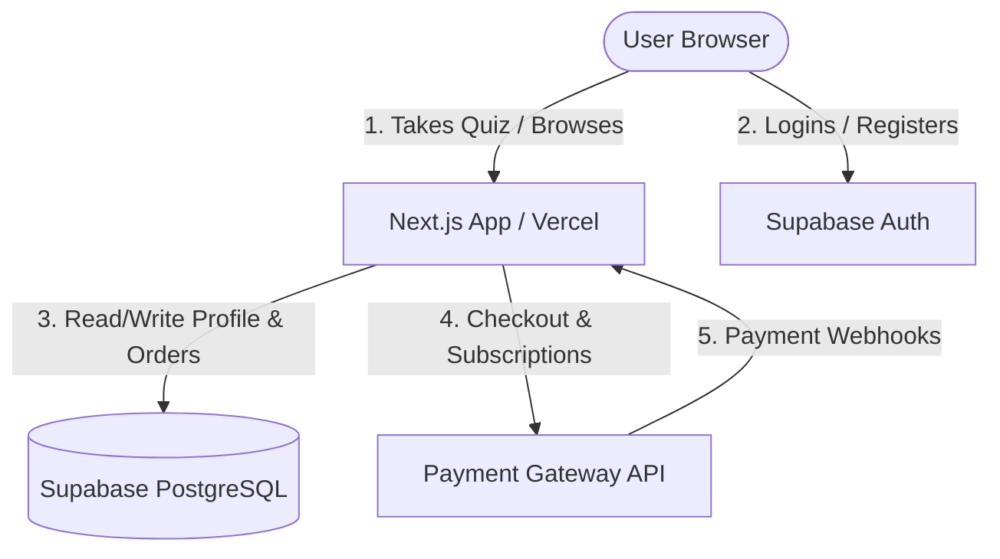
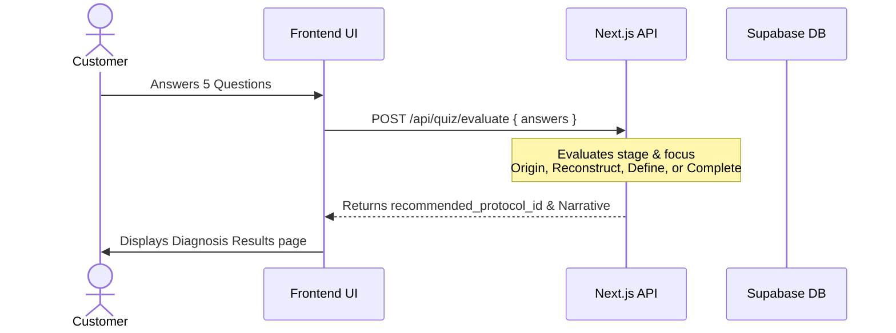
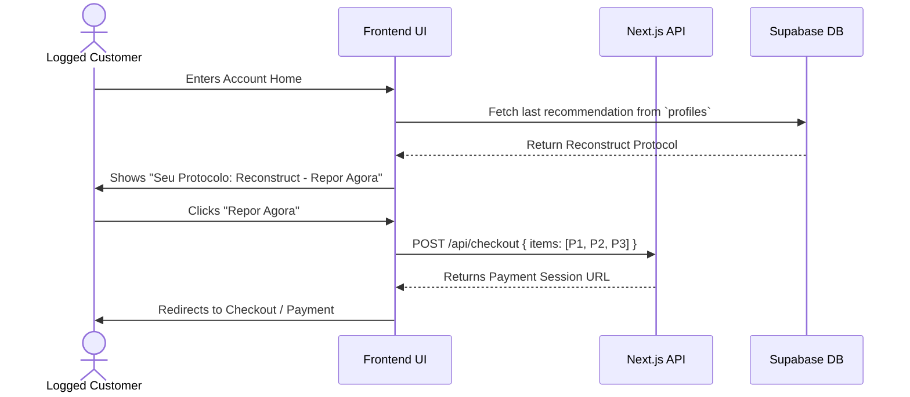

# TRIA Architecture Document
*Ciência para reconstruir sua identidade*

---

## 1. Introduction

### 1.1 Intro Content
This document outlines the overall project architecture for **TRIA**, a premium e-commerce and clinical diagnostics platform. Its primary goal is to serve as the guiding architectural blueprint for development, ensuring consistency and adherence to chosen patterns and technologies.

Core technology stack choices documented herein are definitive for the entire project, covering the Next.js frontend, backend API routes, database schemas, and integration with third-party payment gateways.

### 1.2 Starter Template
The project will be bootstrapped as a greenfield project using **Next.js with TailwindCSS (App Router)** and **Supabase (PostgreSQL)**, providing a solid foundation for serverless routing, user authentication, and high-performance database interactions.

### 1.3 Change Log

| Date | Version | Description | Author |
| :--- | :--- | :--- | :--- |
| 2026-05-29 | 1.0.0 | Initial full-stack architecture based on PRD requirements | Aria (Architect) |

---

## 2. High Level Architecture

### 2.1 Technical Summary
TRIA is built on a serverless full-stack architecture. The frontend application is developed in Next.js, leveraging Server-Side Rendering (SSR) for catalog and SEO performance, and client-side interactivity for the diagnostic quiz. The backend functions as a serverless monolith within Next.js API routes, coordinating business logic, cart validation, and external payment integration. Supabase acts as the primary BaaS provider, handling PostgreSQL data storage, secure client authentication, and row-level security.

### 2.2 High Level Overview
1. **Architectural Style:** Serverless Monolith / BaaS (Backend-as-a-Service).
2. **Repository Structure:** Monorepo (Next.js application hosting both frontend pages and serverless API route handlers under `/api/`).
3. **Data Flow:**
   * Unauthenticated users take the diagnostic quiz. The result recommends a Protocol.
   * On registration/login, Supabase Auth verifies credentials.
   * Authenticated users access their Dashboard, displaying saved quiz recommendations.
   * Customers proceed through checkout, initiating transactions with the Payment Gateway (Credit Card / Pix).
   * Webhook listeners update payment/order status in PostgreSQL database tables.

### 2.3 High Level Project Diagram


### 2.4 Architectural and Design Patterns
* **BaaS (Backend-as-a-Service):** Utilizing Supabase for Authentication and Database. *Rationale:* Reduces infrastructure overhead and secures access using built-in Row-Level Security (RLS).
* **Repository/Service Pattern:** Encapsulating database queries in service modules. *Rationale:* Decouples business logic from direct Supabase query structures, allowing clean unit testing.
* **Quiz Recommendation Strategy Pattern:** Encapsulating recommendation mapping rules in a clean strategy class. *Rationale:* Isolates quiz parsing logic from API controllers, making questionnaire changes simple.

---

## 3. Tech Stack

### 3.1 Technology Stack Table

| Category | Technology | Version | Purpose | Rationale |
| :--- | :--- | :--- | :--- | :--- |
| **Language** | TypeScript | 5.4.x | Primary development language | Strong typing, excellent refactoring support |
| **Runtime** | Node.js | 20.x | JavaScript runtime environment | LTS version, stable package ecosystem |
| **Framework** | Next.js (App Router) | 14.2.x | Full-stack React framework | Server-Side Rendering (SEO), API routes, routing |
| **Styling** | Vanilla CSS + Tailwind | 3.4.x | User Interface Styling | Fast styling, premium UI tokens alignment |
| **Database** | PostgreSQL (Supabase) | 15.x | Data storage and schemas | Relational compliance, RLS security, JSONB support |
| **Authentication**| Supabase Auth | - | Secure customer accounts | Offloads security compliance, OAuth readiness |
| **Payment API** | Stripe / Pagar.me | - | Credit card and Pix processing | Native support for subscriptions and webhook security |
| **Testing** | Jest + React Testing Lib | 29.x | Unit and integration testing | Industry standard, robust mocking APIs |

---

## 4. Data Models

### 4.1 Users Profile (`profiles`)
* **Purpose:** Stores user-specific profile details linked to Supabase Auth accounts.
* **Key Attributes:**
  * `id`: `uuid` (Primary Key, references `auth.users.id`)
  * `full_name`: `text`
  * `created_at`: `timestamp`
  * `last_quiz_recommendation`: `uuid` (References `protocols.id`, nullable)

### 4.2 Products (`products`)
* **Purpose:** Stores individual products.
* **Key Attributes:**
  * `id`: `uuid` (Primary Key)
  * `sku`: `text` (Unique identifier, e.g., `TRIA-P1`)
  * `name`: `text`
  * `price`: `numeric`
  * `category`: `text` (Cabelo, Styling, Barba)
  * `active_ingredients`: `jsonb` (Key-value pairs of active active elements and mechanisms)
  * `inci`: `text` (Official botanical/chemical composition list)

### 4.3 Protocols (`protocols`)
* **Purpose:** Mappings of multi-step kits.
* **Key Attributes:**
  * `id`: `uuid` (Primary Key)
  * `name`: `text` (Origin, Reconstruct, Define, Complete)
  * `price`: `numeric` (Promotional kit price)
  * `original_price`: `numeric` (Sum of individual product prices)
  * `products`: `uuid[]` (Array of product IDs included in the protocol)
  * `narrative`: `text` (Emotional marketing narrative)

### 4.4 User Diagnoses (`user_diagnoses`)
* **Purpose:** Stores the answers and results of the user's diagnostic quizzes.
* **Key Attributes:**
  * `id`: `uuid` (Primary Key)
  * `user_id`: `uuid` (References `profiles.id`, nullable for guests)
  * `answers`: `jsonb` (Stores questionnaire response pairs)
  * `recommended_protocol_id`: `uuid` (References `protocols.id`)
  * `created_at`: `timestamp`

### 4.5 Subscriptions (`subscriptions`)
* **Purpose:** Manages active recurring monthly replenishment plans.
* **Key Attributes:**
  * `id`: `uuid` (Primary Key)
  * `user_id`: `uuid` (References `profiles.id`)
  * `protocol_id`: `uuid` (References `protocols.id`)
  * `status`: `text` (active, paused, cancelled, past_due)
  * `gateway_subscription_id`: `text` (Reference token from Gateway)
  * `next_billing_date`: `timestamp`

---

## 5. Components

### 5.1 Next.js Frontend
* **Responsibility:** Renders the catalog, static technology authority pages, interactive slide-based quiz, and the customer portal dashboard.
* **Key Interfaces:**
  * React Hooks for state management of local cart and quiz steps.
  * API Clients for communication with internal `/api/` endpoints.

### 5.2 Next.js API Routes (Serverless Backend)
* **Responsibility:** Handles validation and processing of checkout carts, executes quiz recommendation calculations, manages user recommendations updates, and authenticates payment gateway webhooks.
* **Key Interfaces:**
  * `GET /api/catalog` - Returns available products and protocols.
  * `POST /api/quiz/evaluate` - Evaluates quiz answers and returns recommended protocol.
  * `POST /api/checkout` - Validates inventory and initiates transaction.
  * `POST /api/webhooks/payment` - Gateway payment status listener.

### 5.3 Supabase Database (PostgreSQL)
* **Responsibility:** Maintains state integrity, logs order history, tracks user profiles, and secures sensitive diagnosis logs using RLS policies.
* **Key Interfaces:**
  * PostgreSQL SQL schema and foreign keys.
  * Row-Level Security (RLS) policies allowing users to read only their own profile, recommendations, and order history.

---

## 6. Core Workflows

### 6.1 Quiz Recommendation Flow


### 6.2 Logged Area Autonomy Replenishment


---

## 7. Database Schema

```sql
-- Enable UUID extension
CREATE EXTENSION IF NOT EXISTS "uuid-ossp";

-- Products Table
CREATE TABLE public.products (
    id UUID PRIMARY KEY DEFAULT uuid_generate_v4(),
    sku TEXT UNIQUE NOT NULL,
    name TEXT NOT NULL,
    price NUMERIC(10,2) NOT NULL,
    category TEXT NOT NULL CHECK (category IN ('Cabelo', 'Styling', 'Barba')),
    active_ingredients JSONB NOT NULL DEFAULT '{}'::jsonb,
    inci TEXT NOT NULL,
    created_at TIMESTAMP WITH TIME ZONE DEFAULT timezone('utc'::text, now()) NOT NULL
);

-- Protocols Table
CREATE TABLE public.protocols (
    id UUID PRIMARY KEY DEFAULT uuid_generate_v4(),
    name TEXT UNIQUE NOT NULL CHECK (name IN ('Origin', 'Reconstruct', 'Define', 'Complete')),
    price NUMERIC(10,2) NOT NULL,
    original_price NUMERIC(10,2) NOT NULL,
    products UUID[] NOT NULL, -- Array of product UUIDs
    narrative TEXT NOT NULL,
    created_at TIMESTAMP WITH TIME ZONE DEFAULT timezone('utc'::text, now()) NOT NULL
);

-- Profiles Table (Linked to Supabase Auth)
CREATE TABLE public.profiles (
    id UUID PRIMARY KEY REFERENCES auth.users(id) ON DELETE CASCADE,
    full_name TEXT,
    last_quiz_recommendation UUID REFERENCES public.protocols(id) ON DELETE SET NULL,
    updated_at TIMESTAMP WITH TIME ZONE DEFAULT timezone('utc'::text, now()) NOT NULL
);

-- User Diagnoses Table
CREATE TABLE public.user_diagnoses (
    id UUID PRIMARY KEY DEFAULT uuid_generate_v4(),
    user_id UUID REFERENCES public.profiles(id) ON DELETE SET NULL,
    answers JSONB NOT NULL,
    recommended_protocol_id UUID REFERENCES public.protocols(id) NOT NULL,
    created_at TIMESTAMP WITH TIME ZONE DEFAULT timezone('utc'::text, now()) NOT NULL
);

-- Subscriptions Table
CREATE TABLE public.subscriptions (
    id UUID PRIMARY KEY DEFAULT uuid_generate_v4(),
    user_id UUID REFERENCES public.profiles(id) ON DELETE CASCADE NOT NULL,
    protocol_id UUID REFERENCES public.protocols(id) NOT NULL,
    status TEXT NOT NULL CHECK (status IN ('active', 'paused', 'cancelled', 'past_due')),
    gateway_subscription_id TEXT UNIQUE NOT NULL,
    next_billing_date TIMESTAMP WITH TIME ZONE NOT NULL,
    created_at TIMESTAMP WITH TIME ZONE DEFAULT timezone('utc'::text, now()) NOT NULL
);

-- Enable Row-Level Security
ALTER TABLE public.profiles ENABLE ROW LEVEL SECURITY;
ALTER TABLE public.user_diagnoses ENABLE ROW LEVEL SECURITY;
ALTER TABLE public.subscriptions ENABLE ROW LEVEL SECURITY;

-- RLS Policies
CREATE POLICY "Users can read own profile" ON public.profiles 
    FOR SELECT USING (auth.uid() = id);

CREATE POLICY "Users can update own profile" ON public.profiles 
    FOR UPDATE USING (auth.uid() = id);

CREATE POLICY "Users can read own diagnoses" ON public.user_diagnoses 
    FOR SELECT USING (auth.uid() = user_id);

CREATE POLICY "Users can insert own diagnoses" ON public.user_diagnoses 
    FOR INSERT WITH CHECK (auth.uid() = user_id OR user_id IS NULL);

CREATE POLICY "Users can read own subscriptions" ON public.subscriptions 
    FOR SELECT USING (auth.uid() = user_id);
```

---

## 8. Source Tree

```plaintext
TRIA/
├── docs/
│   ├── brainstorming-session-results.md
│   ├── prd.md
│   └── architecture.md
├── src/
│   ├── app/                            # Next.js App Router folders
│   │   ├── api/
│   │   │   ├── catalog/route.ts        # GET /api/catalog
│   │   │   ├── checkout/route.ts       # POST /api/checkout
│   │   │   ├── quiz/
│   │   │   │   └── evaluate/route.ts   # POST /api/quiz/evaluate
│   │   │   └── webhooks/
│   │   │       └── payment/route.ts    # POST /api/webhooks/payment
│   │   ├── catalog/                    # Catalog page component
│   │   ├── quiz/                       # Diagnostic quiz interactive client page
│   │   ├── dashboard/                  # Logged customer dashboard
│   │   ├── layout.tsx
│   │   └── page.tsx                    # Landing / Home page
│   ├── components/                     # Reusable UI elements (cards, quiz slider)
│   ├── services/                       # Business logic services
│   │   ├── quiz-evaluator.ts           # Quiz recommendation algorithm logic
│   │   ├── db-service.ts               # Encapsulated Postgres database tasks
│   │   └── payment-service.ts          # Encapsulated gateway communication
│   ├── types/                          # Shared interface TypeScript files
│   └── utils/                          # General help items (formatting, logger)
├── supabase/
│   └── migrations/                     # SQL migration definitions
├── package.json
└── tsconfig.json
```

---

## 9. Error Handling Strategy

* **Exception Categories:**
  * **ValidationError:** Triggered when quiz payload or cart data fails schema requirements (HTTP 400).
  * **PaymentError:** Occurs during payment gateway processing errors (HTTP 402).
  * **DatabaseError:** Triggered on database connection or execution failures (HTTP 500).
* **Logging Standards:** Use winston/pino standard error levels (error, warn, info). Ensure **no** personal identifiable information (PII) like names or diagnostic answers is logged in cleartext.

---

## 10. Coding Standards

* **TypeScript strict mode:** Enabled (`"strict": true` in tsconfig).
* **Next.js App Components:** Default to Server Components unless client-side state hooks (e.g., `useState`, `useEffect`) are explicitly required (such as in the Quiz container).
* **No Inline SQL Queries:** All SQL modifications must happen via Supabase API or stored procedures inside `src/services/db-service.ts`.

---

## 11. Test Strategy

* **Unit Testing:** Write Jest tests for the `QuizEvaluator` logic in `src/services/quiz-evaluator.ts` covering all clinical stages and focus combinations.
* **API Testing:** Integration test coverage for the `/api/quiz/evaluate` and `/api/checkout` API routes.
* **Component Testing:** React Testing Library tests for the interactive quiz step transitions and the dashboard 1-click CTA functionality.
